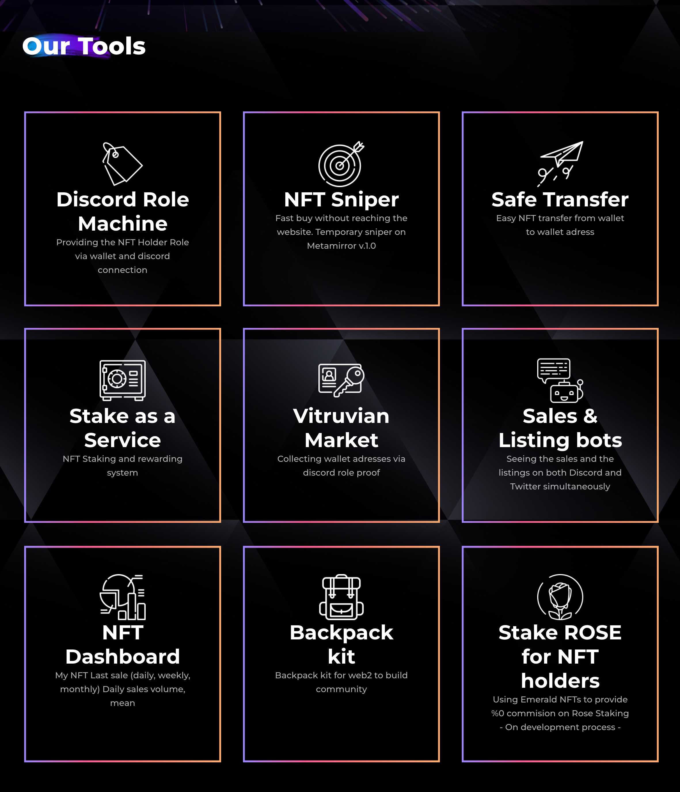

# How to stake?

1. Go to [https://vitruvians.tools/](https://vitruvians.tools) and click **Launch App** (top-right corner)
2. Go to **Stake** from the left menu (or go directly to [https://app.vitruvians.tools/stake-list](https://app.vitruvians.tools/stake-list) )
3. Click **Connect Wallet** (top-right corner)&#x20;
4. Choose an NFT collection which you own and you want to stake

<figure><figcaption></figcaption></figure>

5. Here you will see your NFTs from this collection you selected. Click **Stake** for the NFTs you want to stake. If you want to stake all your NFTs in the same collection, you can click **Select All**

<figure><figcaption></figcaption></figure>

6. Give approval in your wallet and you will start earning $VITRU, or another token specific to your project from now on. Your daily earnings will appear on this same page. Happy earnings!
